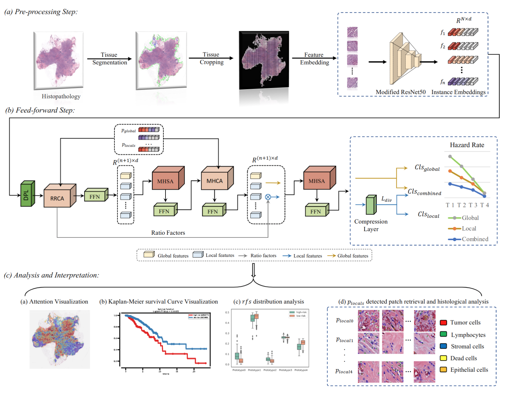
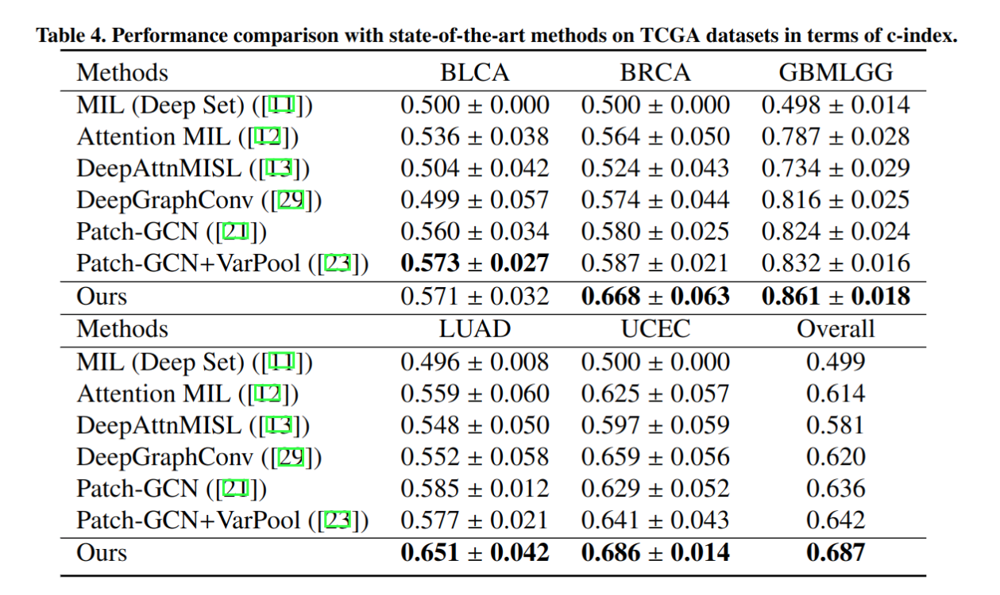

# Surformer : an interpretable pattern-perceptive survival transformer for cancer survival prediction from histopathology whole slide images

This is the official pytorch implementation of Surformer [Surformer : an interpretable pattern-perceptive survival transformer for cancer survival prediction from histopathology whole slide images](https://papers.ssrn.com/sol3/papers.cfm?abstract_id=4423682). 


## Pipline
<div align="center">
  
 </div>
 
 ## Experiment Results on five TCGA tumor datasets
 <div align="center">
  
 </div>

 
 ## Requirements
 ### Installation
Please install pytorch version >=1.2

 ### Dataset Preparation
 Please download the official [TCGA datasets](https://www.cancer.gov/ccg/research/genome-sequencing/tcga) of BRCA, BLCA, GBMLGG, LUAD, and UCEC. 
 For more details of pre-processing, please refer to [CLAM](https://github.com/mahmoodlab/CLAM).
 
 ## Model training and testing
 before training and testing, please update configs. Generally, we train the model with one 12 GB memory GPU. 
 ~~~~~~~~~~~~~~~~~~
   python main.py 
 ~~~~~~~~~~~~~~~~~~

## Citation

If you find this code useful for your research, please cite our paper

```
@article{wang2023surformer,
  title={Surformer: an interpretable pattern-perceptive survival transformer for cancer survival prediction from histopathology whole slide images},
  author={Wang, Zhikang and Gao, Qian and Yi, Xiaoping and Zhang, Xinyu and Zhang, Yiwen and Zhang, Daokun and Li{\`o}, Pietro and Bain, Chris and Bassed, Richard and Li, Shanshan and others},
  journal={Computer Methods and Programs in Biomedicine},
  pages={107733},
  year={2023},
  publisher={Elsevier}
}

@article{wang2023targeting,
  title={Targeting tumor heterogeneity: multiplex-detection-based multiple instance learning for whole slide image classification},
  author={Wang, Zhikang and Bi, Yue and Pan, Tong and Wang, Xiaoyu and Bain, Chris and Bassed, Richard and Imoto, Seiya and Yao, Jianhua and Daly, Roger J and Song, Jiangning},
  journal={Bioinformatics},
  volume={39},
  number={3},
  pages={btad114},
  year={2023},
  publisher={Oxford University Press}
}
```

## Contact

If you have any question, please feel free to contact us. E-mail: [zhikang.wang@monash.edu](zhikang.wang@monash.edu) 

